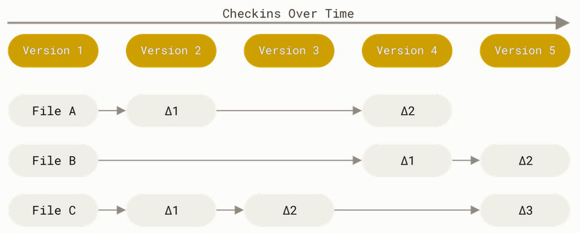
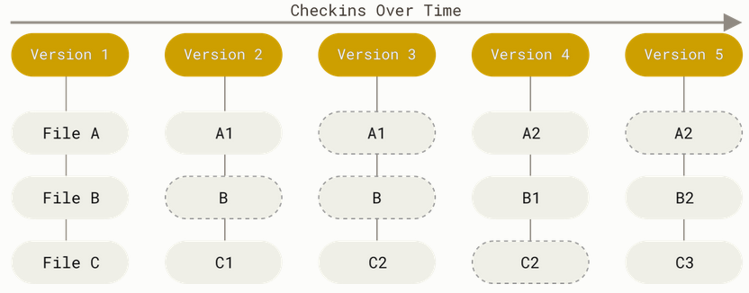

# Git Architecture: Snapshots and Objects

## Overview
Understanding Git's architecture is the key to resolving complex issues. Unlike older Version Control Systems (VCS), Git functions more like a **miniature filesystem** that manages a stream of snapshots over time.

## Snapshots vs. Deltas
Most traditional systems (like SVN or CVS) are **Delta-based**. They store a base version of a file and then keep a list of the "differences" for every subsequent version.

| System Type | Storage Method | Performance Focus |
| :--- | :--- | :--- |
| **Delta-based (SVN)** | Stores changes (diffs) | Saves disk space |
| **Snapshot-based (Git)** | Stores full file versions* | Speed and integrity |

> "The major difference between Git and any other VCS... is the way Git thinks about its data. Conceptually, most other systems store information as a list of file-based changes... Git thinks of its data more like a series of snapshots of a miniature filesystem." — *Pro Git Book*


*Figure 1: Traditional systems store changes to a base version.*


*Figure 2: Git stores a stream of snapshots over time.*

---

## The Git Object Model
To manage these snapshots efficiently, Git uses three main types of objects stored in the `.git/objects` directory:

1.  **Blob (Binary Large Object):** This is just the content of a file. It doesn't store the filename, only the data.
2.  **Tree:** Think of this as a directory. It maps filenames to Blobs and can also point to other Trees (subdirectories).
3.  **Commit:** A snapshot of the root Tree. It includes metadata like the author, date, message, and a pointer to the previous commit (parent).


### Data Integrity (Hashing)
Every object in Git is identified by a unique **SHA-1 Hash** (a 40-character string). If even a single character in a file changes, the Hash changes, and Git treats it as a new object. This ensures that your history is immutable and corruption-free.

---

## Architecture Visualization
This diagram shows how a single **Commit** represents a snapshot of your entire project structure:

```mermaid
classDiagram
    class Commit {
        +String hash
        +String author
        +String message
        +Tree root_tree
    }
    class Tree {
        +String folder_name
        +List items
    }
    class Blob {
        +String file_content
    }

    Commit --> Tree : points to
    Tree --> Tree : contains (subfolder)
    Tree --> Blob : contains (file)