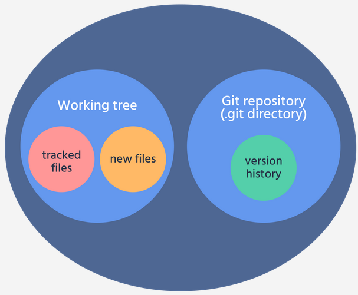
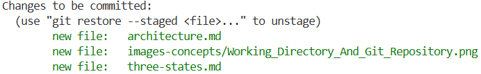

# Three States of Git

## Overview
Git is not just about saving files; it is about managing a file's lifecycle. To understand Git, you must first understand that a file exists in three distinct areas on your computer before it is permanently recorded in the project history. This structure allows you to have total control over what is saved and when.

**The Three Stages:**
1.  **Working Directory:** (Where you work)
2.  **Staging Area:** (Where you prepare)
3.  **Local Repo:** (Where you save)

---

## 1. Working Directory
The Working Directory (or Working Tree) is the actual folder on your computer where you see and edit your project files using tools like VS Code.
* **Function:** This is where you perform all modifications, updates, and creations of files.
* **Status:** Files here are "Unstaged." Git notices changes, but they are not yet protected or "tracked" in a way that allows recovery.
* **Visibility:** Run `git status` to see these files.
    * **Red Files:** These are either *Untracked* (new files) or *Modified* (existing files with unsaved changes).



---

## 2. Staging Area (Index)
The Staging Area acts as a "loading dock" or a buffer between your workspace and the permanent history.
* **Function:** This is where you prepare your next commit. It allows you to "cherry-pick" exactly which changes should be saved together in one logical group.
* **Commands:**
    * `git add <FileName>` – Adds a specific file to the stage.
    * `git add .` – Adds all modified and new files from the project root.
* **Status:** Files are now "Tracked" and ready to be committed. They usually appear in **green** when running `git status`.



---

## 3. Local Repo (.git directory)
The Local Repo is Git’s internal database (the `.git` folder) where all your snapshots are stored permanently.
* **Function:** When you "commit," Git takes a snapshot of all the files currently in the Staging Area and assigns them a unique ID.
* **Command:** `git commit -m "A descriptive message about your changes"`
* **Status:** Your changes are now safely integrated into the Git history. You can revert back to this specific point at any time in the future.

---

## FAQ: Frequently Asked Questions

> **Why do I need a Staging Area? Why not just commit directly?**
> The Staging Area gives you precision. If you fix two different bugs, you can stage and commit them separately to keep your history clean and readable for others.

> **What happens if I edit a file again after running `git add`?**
> The file will exist in two states simultaneously: the version you "added" is in the **Staging Area**, while your newer changes remain in the **Working Directory**. You must run `git add` again to update the stage with the latest version.

> **Is the "Local Repo" the same as GitHub?**
> No. The Local Repo exists only on your machine. To share your commits with others on GitHub (a *Remote Repo*), you must use the `git push` command.

---

## Visualizing the Flow
This diagram illustrates how data moves between the three areas:

```mermaid
flowchart LR
    A[Working Directory] -- "git add" --> B[Staging Area]
    B -- "git commit" --> C[Local Repo]
    C -- "git checkout / switch" --> A
    
    style A fill:#f9f,stroke:#333,stroke-width:2px
    style B fill:#bbf,stroke:#333,stroke-width:2px
    style C fill:#bfb,stroke:#333,stroke-width:2px