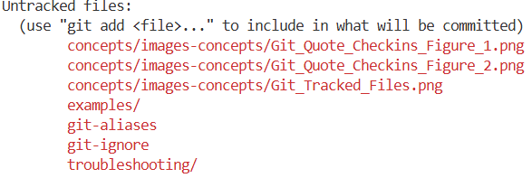
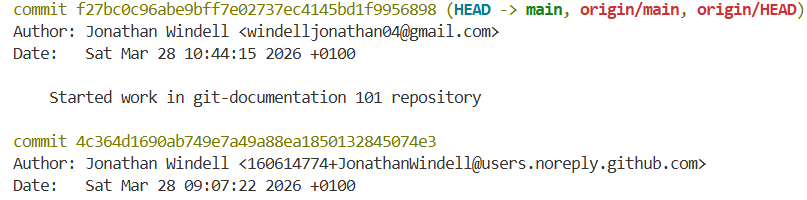
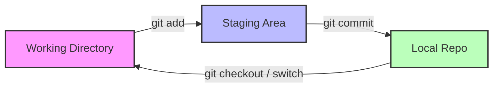

# Git Basics: Your Daily Workflow

## 1. Prerequisites & Initial Configuration
Begin by heading over to [Git Install](https://git-scm.com/install/) to first install git on your system.

**Operating Systems Supported by Git**
1. **Windows**
2. **MacOS**
3. **Linux**

> ***Note:*** You can also build from source and cherry pick what you wish to install but I would advise against since this is a complicated process and Git is already lightweight. 

To configure git I recommend reading the [First-Time Git Setup](https://git-scm.com/book/ms/v2/Getting-Started-First-Time-Git-Setup) documentation as this provides clear steps as to what needs to be configured before you can start using git. 

## 2. Starting a Project
Start a project is easiest done by heading over to [Github](https://github.com/) and creating a repository through their service. Github provides an interface for git and allows for easier maintaing of your git repository. 

If you wish to create a git repository you can follow this tutorial. [Getting a Git Repository](https://git-scm.com/book/en/v2/Git-Basics-Getting-a-Git-Repository). 

**Steps to create a git repository:**
```git
1. cd /path/to/your/existing/code #This is where you choose what folder or file to create a git repo in. 
2. git init #The init command stands for "initialize" and creates a git repository. 
```
> ***Note:*** You can also use.
```git
git init <project directory> #This creates a git repository in your chosen directory. 
```

### 2.1 Cloning an Existing Repository (`git clone`)
Cloning a git repostitory means you have already created a git repository but it's maybe on another machine and you wish to get access on your current machine. 

```git
git clone <repo url>
```

## 3. The Core Workflow (The Daily Cycle)
The daily cycle is the usual flow of what you will do when using git. This flow contains the usual commands and are therefore needed knowledge as how to use git on a daily basis. 

### Step 1: Checking Status (`git status`)
The command `git status` is used to view files which have not yet been added to the staging area. These files will be marked with the color red. 

**Example:**



### Step 2: Staging Changes (`git add`)
The command `git add` is used to add the files to the staging area which I discuss in [three-states](https://github.com/JonathanWindell/Git-Documentation-101/blob/main/concepts/three-states.md)

You can either cherry pick files you wish to commit by using `git add <FileName>` or add every file that has been changed with git reading from the root `git add .`. 

### Step 3: Recording Changes (`git commit`)
The command `git commit` is used when you have choosen the files you wish to stage and want to commit them to the github repository. With every commit it is recommended to add a message of what you have worked on to simplify finiding commits and keeping a log of what every commit contains. The command with message is written `git commit -m <"Your commit message">`. 

## 4. Reviewing Your History
Reviewing you git history is something everyone will cross paths with at sometime. This might be because of you wish to revert back to another commit or just watch how git's history is currently strucutred. 

### 4.1 Viewing the Commit Log (`git log`)
The command `git log` is used to show the log of all git changes that have been made. There is however a few things you can add to the git log command to make it more readable and easier to manage. 

> ***Note:*** Only the commits that are reacheable by following the `Parent` links from the given commit(s) will be shown. The commit(s) that have a `^` can not be reached. 

Given there is a lot of extensions to the `git log` command that can be used I suggest you read about in the offical [Git log documentation](https://git-scm.com/docs/git-log).

**Example:**



### 4.2 Comparing Changes (`git diff`)
The command `git diff` shows the differences between each commit(s), working trees, blobs etc. 

Given there is a lot of extensions to the `git diff` command that can be used I suggest you read about in the offical [Git log documentation](https://git-scm.com/docs/git-diff). 

## 5. Summary Reference Table
| Command | Action | Scope |
| :--- | :--- | :--- |
| `git init` | `Initialises git repository.` | `Project Root` |
| `git status` | `shows status of all files. Tracked & Untracked.` | `Working Directory` |
| `git add` | `Adds file to be tracked.` | `Index/Staging` |
| `git commit` | `Commits files to git repository.` | `Local Repository` |
| `git log` | `Shows all git changes and commits.` | `Project History` |
| `git diff` | `Shows difference between files.` | `Unstaged Changes` |

## 6. Visualizing the Basic Cycle

