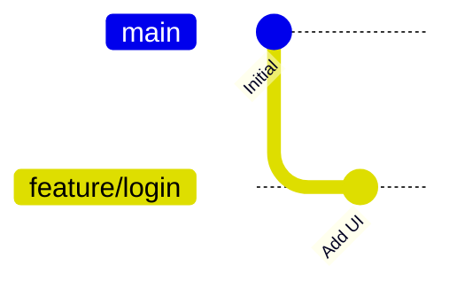

# Git Branching: Advanced Workflows

## 1. Introduction: The Power of Parallel Development
The use of branching is very common when working in a team of developers that all contribute to the same product of code. Branches are used to create independent "timelines" of the main branch code in the repository. It's like having to chef's prepare different parts of the meal and in the end combine them to a complete meal to the customer. Branching is also a safe way to ensure that the code on the main branch is kept neat and working. When we work on our own branch the code the commit(s) we do has no impact on the code on the main branch. 

Pointer management in git is how it remembers what came before your branch out. This pointer is created when you commit and uses the pointer as a reference to the commit(s) before. The commits made before are called parent(s) To read more about git branching and how pointers work I recommend [Git Branches in a Nutshell](https://git-scm.com/book/en/v2/Git-Branching-Branches-in-a-Nutshell) which is the official documentation for git. 

---

## 2. Tutorial: Your First Feature Branch
* **Goal:** Create a branch and make changes. 
This is a good exercise as you use git hands on to learn how branching works. Try it for yourself!

* **Step 1:** Creating the branch.

- **1.1:** `git checkout -b <User_Branch>`. This command creates a branch and immediately switches to it. 

* **Step 2:** View your Branch.

- **2.1:** Use the command `git branch` to view all the branches you're able to reach.

> ***Note:*** Branches you have created are local until you push them. Another team member will never be able to use `git checkout <Name>` to your branch. 

* **Step 3:** Switching contexts.

- **3.1:** `git checkout <Branch_Name>`. This command allows you to switch branches without creating a new one. 

---

## 3. How-To Guides: Common Branching Tasks
* **How to Delete Stale Branches:** Cleaning up local and remote references.

When a branch is not used anymore it's advised to remove the branch as it will otherwise create confusion and irritation for you and your co-developers since branching can become quite a net of mess if not regurlaly maintained. You can remove a branch by using the command `git branch -d <name>`. 

---

## 4. Visualizing the Branching Strategy

## 5. Architecture: The "Git Flow" Model
- **Main/Production:** The stable state of the software.
- **Develop:** The integration branch for features.
- **Feature Branches:** Short-lived branches for specific tasks.
- **Hotfix Branches:** Critical repairs for production.

## 6. Reference: Branching Commands
| Command | Action |
| ------- | ------ |
| `git branch` | List, create, or delete branches. |
| `git checkout -b <name>` | Create a new branch and switch to it immediately. |
| `git merge <branch>` | Join two or more development histories together. |
| `git rebase <base>` | Reapply commits on top of another base tip. |
| `git branch -d <name>` | Delete a branch that has been merged. |
