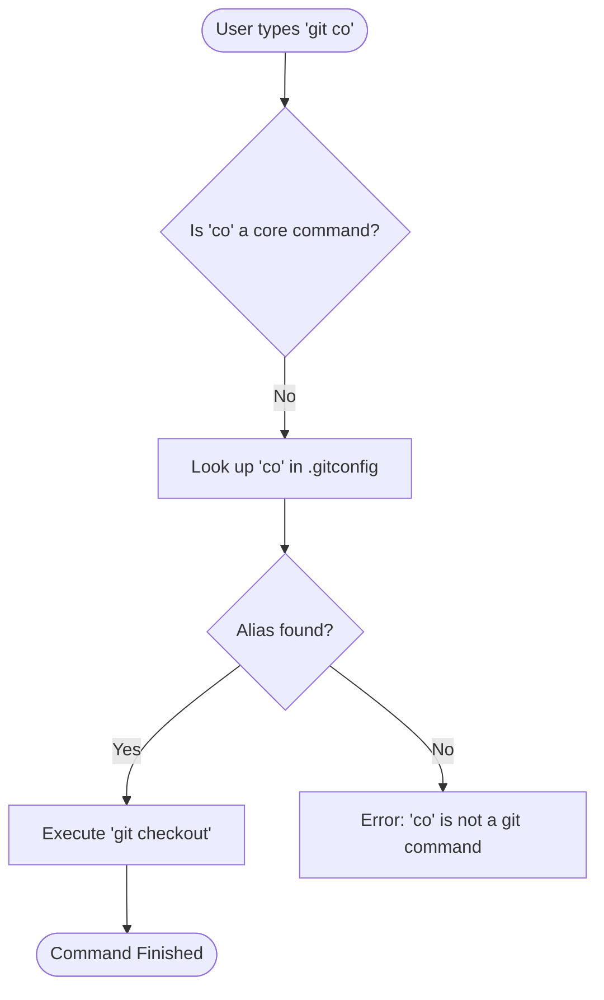

# Git Aliases

## 1: Introduction: How to Use Git Aliases
When working with git we might sometimes want to speed up our work in the terminal if we find ourselves typing the same commands repeatedly or if the commands are difficult to remember. By creating aliases we can create a short version that's a combination of one or more commands we wish to be executed when we write the alias. 

## 2: Tutorial: How to Create Aliases

* **Step 1:** Creating the shortcuts in the `git config` file. 
This is the file where git stores it's config and here is also where you can define your shortcuts. You can define aliases like this.

**Example:**
```git
$ git config --global alias.co checkout
$ git config --global alias.br branch
$ git config --global alias.ci commit
$ git config --global alias.st status
```

Now these are just one command. Where git aliases shine is when you combine two or more commands together. 

**Example:**

```git
$ git config --global alias.unstage 'reset HEAD --'
```

which is the equivalent to typing.

```git
$ git unstage fileA
$ git reset HEAD -- fileA
```

## 3. How-To: Advanced Shell Aliases

Goal: Execute external scripts or complex shell pipelines via Git.

Sometimes a simple Git command isn't enough. By prefixing your alias with !, you can execute any shell command.

**Example:** Deleting all merged branches

This is a common cleanup task that requires a pipe of commands.
```bash
$ git config --global alias.cleanup "!git branch --merged | grep -v '*' | xargs -n 1 git branch -d"
```

**Example:** Opening the last commit in a text editor
```bash
$ git config --global alias.edit-last "!vim $(git diff --name-only HEAD^)"
```

## 4. Visualizing the Alias Logic
