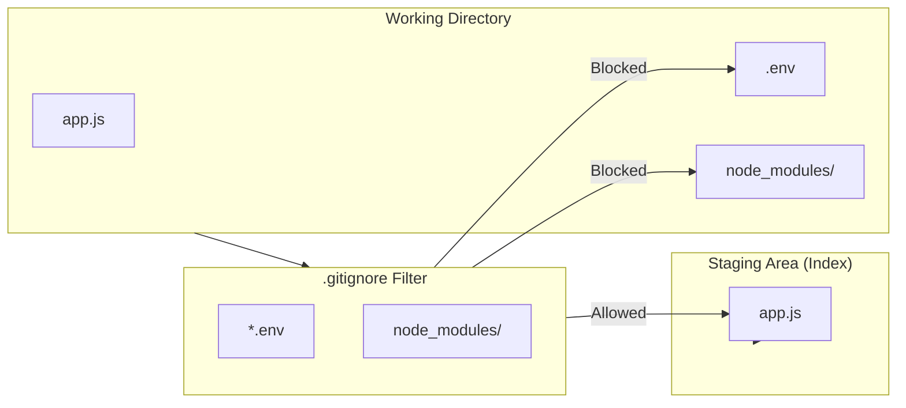

# Gitignore & Noise Control

---

## 1. Introduction: Filtering the Noise
The `.gitignore` file tells Git which files or directories to ignore in a project. This prevents "noise" (like dependencies, logs, or OS-generated files) and sensitive data (like API keys) from being committed to the repository history.

---

## 2. How-To: Creating and Using .gitignore
*Goal: Set up a basic filter for your project.*

1.  **Create the file:** Create a file named exactly `.gitignore` in your project root.
2.  **Add patterns:** Add the names of files or folders you want to exclude.
3.  **Check status:** Run `git status` to verify that the ignored files no longer appear as "Untracked".

---

## 3. Reference: Common Patterns
*Quick snippets for different environments.*

| Pattern | Description | Example |
| :--- | :--- | :--- |
| `*.log` | All files ending in .log | `error.log`, `system.log` |
| `node_modules/` | Entire directory and its contents | Heavy dependencies |
| `.env` | Specific sensitive files | API keys, Secrets |
| `dist/` | Build output folders | Compiled code |
| `[Dd]esktop.ini` | Pattern matching (case insensitive) | OS-specific files |

---

## 4. Visualizing the Filter Process

The following diagram illustrates how the `.gitignore` acts as a gatekeeper between your workspace and the Staging Area.



## 5. Troubleshooting: Files That are Already Tracked

*Explanation: Why is my ignored file still showing up?*

A common mistake is adding a file to `.gitignore` after it has already been tracked/committed. Git will continue to track changes to that file because it is already in the Index.

**The Solution:** You must manually remove it from the Index (but keep it on your disk):

```git
$ git rm --cached <file_name>
```
