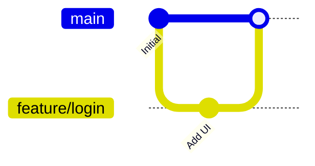

# Git Merging: Advanced Workflows

## 1. Introduction: How Merges Work
A merge is used when you have finished your work on a branch and you want to merge it to main. Merging is when you take your made changes on your branch and move them over to the main branch so that the changes you made can now be reached by everyone in your team. 

## 2. Tutorial: Merge your First Feature Branch
* **Goal:** Merge the `feature` branch to the `main` branch. 
This is a good exercise because we always want to keep main updated with the work that we have done. This can often be features or fixes that the whole team may need to keep continuining with their work. 

* **Step 1:** Finding the Main Branch.

- **1.1:** `git branch`. This command shows all the branches that you can reach. Usually the master branch has the name `main`. 

* **Step 2:** Merging the Branches.

- **2.1:** `git checkout main`. Jump to the main branch.

* **Step 3:** Executing the Merge.

- **3.1:** `git merge <name_of_branch>`. This merges the feature branch with the main branch. 

This how a basic merge looks like. But often this is not how teams merge. It could be that there are what's called merge conflicts. Documentation for merge conflicts can be found here [Merge Conflicts]() between the `feature` & `main` branches in which the `main` branch will break. This is why the better and more professional way is often to push the `feature` branch to github and validate if there are any merge conflicts before merging to the main branch. Documentation for that can be found here [Github Pull Requests]()

## 3. Visualizing the Merging Strategy

## 4. Architecture: The "Git Flow" Model
- **Main/Production:** The stable state of the software.
- **Develop:** The integration branch for features.
- **Feature Branches:** Short-lived branches for specific tasks.
- **Hotfix Branches:** Critical repairs for production.

## 5. Reference: Merging Commands
| Command | Action |
| ------- | ------ |
| `git branch` | List, create, or delete branches. |
| `git merge <name_of_branch>` | Create a new branch and switch to it immediately. |

