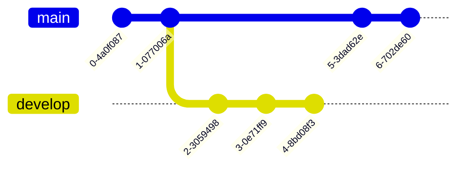
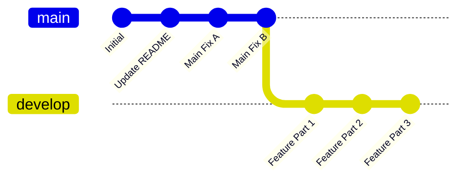

# Git Rebasing: Advanced Workflows

## 1. Introduction: How Rebasing Works

Rebasing is very much like merging but with more features. In a rebase you're able to take all the changes that were committed on one branch and replay them on a different branch. Rebasing allows the user to choose which versions that should be taken before causing a merge conflict.

A rebase moves the feature branch to the latest commit on the main branch, allowing us to stay on top of what has happened on the main branch. We always want to solve merge conflicts locally and not on the main branch.

---

## 2. Tutorial: Execute your First Rebase

* **Step 1:** Rebasing Feature branch from Main Branch.
  - **1.1:** `git rebase origin/main` — This command replays your branch commits on top of the latest main branch.

* **Step 2:** Resolving conflicts during a rebase.
  - **2.1:** If there are merge conflicts you will need to solve them manually, then stage the resolved files using `git add <FileName>`.
  - **2.2:** Once conflicts are resolved, run `git rebase --continue` to proceed with the rebase.

This is how a basic rebase looks like. If you wish to know more or visualize it I recommend [Git official documentation](https://git-scm.com/book/en/v2/Git-Branching-Rebasing) as they cover rebasing even more in depth, and [Byte Byte Go](https://www.youtube.com/watch?v=0chZFIZLR_0) which visualizes how merges, rebasing and squashing works.

---

## 3. Visualizing the Rebasing Strategy



This is how it usually looks like in a real world scenario. You are on your own branch and working meanwhile your other co-developers are merging their commits to `main`. Now we could perform a merge but given we are not done yet with our feature we just want to get `main` branch changes to our branch so we work in a more linear timeline. This is where we use a rebase so our `feature` branch jumps to the last made merge on `main`.



---

### 3.1. Aborting a Rebase

Sometimes a rebase can go wrong — conflicts are too complex, or you simply started the rebase on the wrong branch. In these cases you can safely abort the rebase and return your branch to the exact state it was in before you started.

```bash
git rebase --abort
```

This cancels the ongoing rebase and restores your branch to its original state. No changes are lost. Use this whenever you feel unsure mid-rebase — it is always safe to abort, fix the situation, and start over.

**When to abort:**
- The number of conflicts is unexpectedly large and you need to re-evaluate your approach.
- You realize you ran `git rebase` against the wrong target branch.
- You want to switch strategy and use a merge instead.

---

### 3.2. Cherry Picking

Cherry picking allows you to take a **single specific commit** from any branch and apply it onto your current branch — without merging or rebasing the entire branch. Think of it as "I want just that one commit, not everything else."

```bash
git cherry-pick <commit-hash>
```

**Example scenario:**

A hotfix was committed to a colleague's branch but has not been merged to `main` yet. You need that fix on your feature branch right now. Instead of merging their whole branch, you cherry-pick only that one commit.

```bash
# Find the commit hash you need
git log origin/colleague-branch --oneline

# Apply just that commit to your current branch
git cherry-pick a1b2c3d
```

**Cherry picking a range of commits:**

```bash
git cherry-pick <start-hash>^..<end-hash>
```

This applies all commits from `<start-hash>` up to and including `<end-hash>` onto your current branch.

**Handling conflicts during cherry-pick:**

If a conflict occurs, resolve it manually, stage the file, then continue:

```bash
git add <FileName>
git cherry-pick --continue
```

To abort a cherry-pick and return to the previous state:

```bash
git cherry-pick --abort
```

**When to use cherry-pick vs rebase:**

| Situation | Recommended Tool |
|-----------|-----------------|
| You need all new commits from `main` on your branch | `git rebase` |
| You need one specific commit from another branch | `git cherry-pick` |
| You want to replay a bug fix from a hotfix branch | `git cherry-pick` |
| You want to sync your feature branch with `main` | `git rebase` |

---

## 4. Reference: Rebasing Commands

| Command | Action |
| ------- | ------ |
| `git rebase <origin/name_of_branch>` | Starts rebase by fetching the chosen branch to rebase onto. |
| `git rebase --continue` | After resolving conflicts and staging files, continues the rebase. |
| `git rebase --abort` | Cancels the rebase and restores the branch to its pre-rebase state. |
| `git rebase --skip` | Skips the current conflicting commit and continues with the next one. |
| `git cherry-pick <commit-hash>` | Applies a single commit from any branch onto the current branch. |
| `git cherry-pick <start>^..<end>` | Applies a range of commits onto the current branch. |
| `git cherry-pick --continue` | Continues cherry-pick after resolving conflicts. |
| `git cherry-pick --abort` | Cancels the cherry-pick and restores the previous state. |
| `git add <FileName>` | Stages a conflict-resolved file before continuing a rebase or cherry-pick. |
| `git log --oneline` | Lists commits with short hashes — useful for finding cherry-pick targets. |