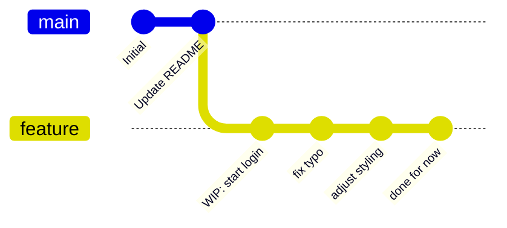
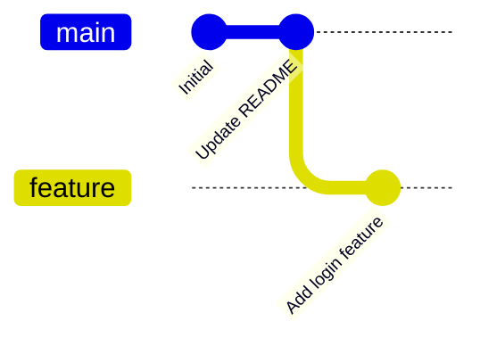

# Git Squashing: Strategies and Workflows

## 1. Introduction: How Squashing Works

Squashing is the process of combining multiple commits into a single commit. Instead of cluttering your branch history with small, incremental commits like "fix typo", "WIP", or "adjust styling", squashing lets you present one clean, meaningful commit that represents the full scope of your work.

Squashing is most commonly done before merging a feature branch into `main`. It keeps the main branch history readable and makes it easier to track what changed and why. Unlike rebasing, squashing does not move your commits to a new base — it collapses them in place.

---

## 2. Tutorial: Execute your First Squash

* **Step 1:** Start an interactive rebase targeting the commits you want to squash.
  - **1.1:** `git rebase -i HEAD~N` — Replace `N` with the number of commits you want to squash. For example, `HEAD~4` opens the last 4 commits for editing.

* **Step 2:** Mark commits for squashing in the interactive editor.
  - **2.1:** Your editor will open with a list of commits. The top commit is the oldest. Change `pick` to `squash` (or `s`) on every commit you want to fold into the one above it. Always leave the first commit as `pick`.
  - **2.2:** Save and close the editor to proceed.

* **Step 3:** Write the final commit message.
  - **3.1:** Git will open a second editor showing all the original commit messages combined. Delete or rewrite them into a single, clear commit message describing the full change.
  - **3.2:** Save and close — your squash is complete.

For further reading and visuals, check out the [Git official documentation](https://git-scm.com/docs/git-rebase) on interactive rebasing, and [Byte Byte Go](https://www.youtube.com/watch?v=0chZFIZLR_0) which visualizes how merges, rebasing and squashing work together.

---

## 3. Visualizing the Squashing Strategy



This is what a feature branch often looks like in practice — many small commits that made sense in the moment but would pollute the `main` history if merged as-is. Before opening a pull request, we squash these into one clean commit.



After squashing, the branch presents a single, well-named commit. When this gets merged into `main`, the history stays clean and meaningful for every team member reading it later.

---

### 3.1. Squashing with a Merge (--squash flag)

An alternative to interactive rebase is using the `--squash` flag directly on `git merge`. This approach squashes all commits from the feature branch into a single staged change on `main`, which you then commit manually.

```bash
git checkout main
git merge --squash feature/my-feature
git commit -m "Add login feature"
```

Note that `git merge --squash` does **not** create a merge commit and does **not** preserve the branch relationship in history. It is best used when you want a clean, flat history and do not need the feature branch to remain traceable after merging.

---

### 3.2. Aborting a Squash

If something goes wrong during an interactive rebase squash, you can safely abort and return to the state before you started.

```bash
git rebase --abort
```

This cancels the entire operation and restores your branch exactly as it was. No commits are lost. Use this if the editor output looks unexpected, conflicts appear that you are not ready to resolve, or you want to rethink your squash strategy.

**When to abort:**
- You accidentally squashed commits you wanted to keep separate.
- Conflicts appeared mid-rebase that you are not ready to resolve.
- You started the rebase on the wrong branch or with the wrong `HEAD~N` count.

---

## 4. Reference: Squashing Commands

| Command | Action |
| ------- | ------ |
| `git rebase -i HEAD~N` | Opens the last N commits in the interactive rebase editor for squashing. |
| `git rebase -i <commit-hash>` | Opens all commits after the given hash for interactive editing. |
| `git rebase --abort` | Cancels the rebase/squash and restores the branch to its original state. |
| `git rebase --continue` | After resolving conflicts, continues the squash operation. |
| `git merge --squash <branch>` | Squashes all commits from a branch into a single staged change. |
| `git commit -m "<message>"` | Creates the final squashed commit after a `git merge --squash`. |
| `git log --oneline` | Lists commits with short hashes — useful for counting how many to squash. |
| `git diff HEAD~N HEAD` | Previews all changes across the last N commits before squashing. |