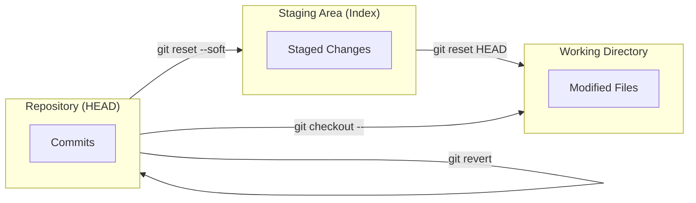

# undoing-commits.md

# Undoing Mistakes in Git: A Comprehensive Guide

This reference provides templates and workflows for correcting mistakes at various stages of the Git lifecycle, from local edits to pushed commits.

---

## 1. Introduction: Reverting Changes
Sometimes things do not go to plan when working with Git. It is important to know how to undo actions or revert back to old commits. 

**Important:** Some "undo" commands are destructive. If you haven't committed your work, you may lose it permanently. Always check your status before performing a hard reset or checking out files.

---

## 2. Tutorials: Amending, Unstaging & Unmodifying

### 2.1 Amending a Commit
Amending is used to "fix" the most recent commit. Use this if you forgot a file or need to change the commit message.

```bash
# 1. Stage the forgotten file
$ git add <file_name>

# 2. Amend the commit
# Use --no-edit to keep the old message, or omit it to write a new one
$ git commit --amend --no-edit
```

### 2.2 Unstaging a File
Unstaging moves a file from the "Staging Area" back to the "Working Directory." This is helpful if you accidentally added a file (like a .env file) that shouldn't be in the next commit.

```bash
# Move the file out of the staging area
$ git reset HEAD <file_name>

# Example output:
# Unstaged changes after reset:
# M   CONTRIBUTING.md
```

### Unmodifying a File (Discarding Local Changes)
Unmodifying a File (Discarding Local Changes)

> ***Warning:*** This is a dangerous command. All local, uncommitted changes to that file will be deleted.

```bash
git checkout -- <file_name>
```

## 3. Handling Pushed Mistakes

If a commit has already been pushed to a remote server, never use `reset` (as it rewrites history and breaks things for teammates). Instead, use `revert` to create a new "inverse" commit.

- 1. Find the commit ID: `git log --oneline`
- 2. Revert the commit: `git revert <commit_hash>`
- 3. Push the fix: `git push origin <branch_name>`

## 4. Visualizing the "Undo" Flow



## 5. Reference Table

| Command | Action | Risk Level | Best Use Case |
| ------- | ------ | ---------- | ------------- |
| `git commit --amend` | Updates last commit | Low | Forgot a file or fixed a typo |
| `git reset <file>` | Unstages a file | Low | Accidentally ran `git add`. |
| `git checkout -- <file>` | Discards local changes | **Extreme** | git checkout -- <file> |
| `git revert <hash>` | Create inverse commit | **Safe** | Undoing errors on a shared branch. | 
| `git reset --hard` | Wipes all local work | **Extreme** | Resetting everything to specific commit |

## 6. The Ultimate Safety Net: `git reflog`

If you accidentally perform a `hard reset` and lose a commit, Git records every move of the `HEAD` pointer in the `reflog`.

```bash
# 1. View the history of HEAD movements
$ git reflog

# 2. Find the hash of the "lost" commit and reset back to it
$ git reset --hard <hash_from_reflog>
```
