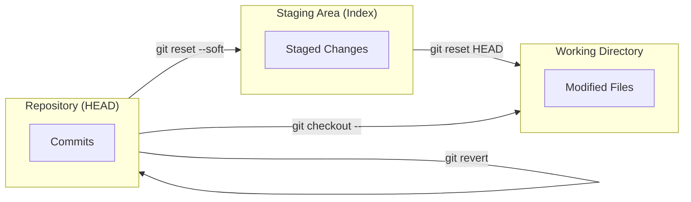

## Undoing Mistakes

## 1. Introduction: Reverting Made Changes
Sometimes things to do not go to plan when we're working with git. This is why it's important to know how undo things or revert back to old commits that we're working. **Important** thing to know when working with undoing is that you can't always undo some of the undos you have done meaning you might lose some of the work you've done. One of the common things that might require an undo is commiting to early and forgetting some files you have not added and started tracking. 

## 2. Tutorials: How to Amend, Unstage & Unmodify file(s)


### 2.1: Amending a File. 
Amending is when you wish to "fix" a commit you have made. Maybe you forgot a file that you wanted the commit to include. 

**Example:**
```git
$ git commit -m 'Initial commit'
$ git add forgotten_file
$ git commit --amend
```

### 2.2: Unstaging a File
Unstaging a file is when you remove a file from the tracked files. This might be because you don't want the file to be pushed to a remote repository such as `.env` file. 

> ***Note:*** A `.env` should always be included in your gitignore file. 

```git
$ git reset HEAD CONTRIBUTING.md
Unstaged changes after reset:
M	CONTRIBUTING.md
$ git status
On branch master
Changes to be committed:
  (use "git reset HEAD <file>..." to unstage)

    renamed:    README.md -> README

Changes not staged for commit:
  (use "git add <file>..." to update what will be committed)
  (use "git checkout -- <file>..." to discard changes in working directory)

    modified:   CONTRIBUTING.md
```

### 2.3: Unmodifying a File
If you realise you don't want the changes you made to a specific file you can unmodify the file. 

```git
$ git checkout -- CONTRIBUTING.md
$ git status
On branch master
Changes to be committed:
  (use "git reset HEAD <file>..." to unstage)

    renamed:    README.md -> README
```

> ***Important:*** It’s important to understand that `git checkout -- <file>` is a dangerous command. Any local changes you made to that file are gone — Git just replaced that file with the last staged or committed version. Don’t ever use this command unless you absolutely know that you don’t want those unsaved local changes.

## 3. How-To: Handling Pushed Mistakes
Goal: Fix errors that have already been shared with the team.

**How to Safely Undo a Pushed Commit:**

If a commit is already on the server, you should never use `reset` (as it rewrites history). Instead, use `revert` to create a new commit that does the exact opposite.

1. Find the commit hash: `git log --oneline`
2. Revert it: `git revert <hash>`
3. Push the fix: `git push origin <branch>`

## 4. Visualizing the "Undo" Flow


## 5. Reference: Branching Commands
| Command | Action | Risk Level |
| ------- | ------ | ---------- |
| `git commit --amend` | Update last commit | Low |
| `git reset <file>` | Unstage file | Low |
| `git checkout -- <file>` | Discard local changes | Extreme |
| `git revert <hash>` | Inverse commit | Safe |
| `git reset --hard` | Wipe all local changes | Extreme |

## 6. Explanation: The Ultimate Safety Net (`git reflog`)
Think of `reflog` as Git's "Emergency Room." Git records every time the `HEAD` pointer moves (e.g., during checkouts, commits, or resets).

If you accidentally perform a `git reset --hard` and lose a commit, you can find the commit's ghost in the reflog:
```git
$ git reflog
# Output: e123abc HEAD@{1}: reset: moving to HEAD~1
$ git reset --hard e123abc
```